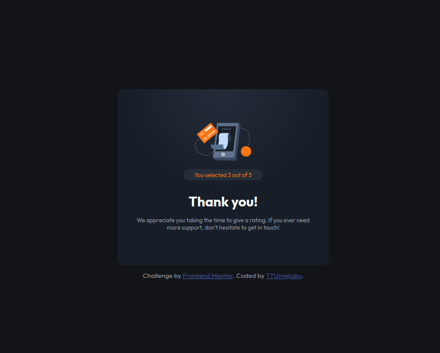

# Frontend Mentor - Interactive rating component solution

This is a solution to the [Interactive rating component challenge on Frontend Mentor](https://www.frontendmentor.io/challenges/interactive-rating-component-koxpeBUmI). Frontend Mentor challenges help you improve your coding skills by building realistic projects.

## Table of contents

- [Overview](#overview)
  - [The challenge](#the-challenge)
  - [Screenshot](#screenshot)
  - [Links](#links)
- [My process](#my-process)
  - [Built with](#built-with)
  - [What I learned](#what-i-learned)
  - [Continued development](#continued-development)
- [Author](#author)
- [Acknowledgments](#acknowledgments)

## Overview

### The challenge

Users should be able to:

- View the optimal layout for the app depending on their device's screen size
- See hover states for all interactive elements on the page
- Select and submit a number rating
- See the "Thank you" card state after submitting a rating

### Screenshot




### Links

- Solution URL: (https://github.com/TTUmejiaku/Interactive-Rating-Component)
- Live Site URL: (https://ttumejiaku.github.io/Interactive-Rating-Component/)

## My process

### Built with

- Semantic HTML5 markup
- CSS custom properties
- Flexbox
- Mobile-first workflow

### What I learned

- Perfected how to center an item inside a circle using inline-flex.
- Had a bug because of variable scope - so rectifying this bug helped me understood variable scoop better.

```css
.star-icon-container i {
  display: inline-flex;
  align-items: center;
  justify-content: center;
  border-radius: 50%;
  width: 30px;
  height: 30px;
  background-color: var(--dark-blue);
}
```

```js
ratings.forEach(function (rating) {
  rating.addEventListener("click", function (e) {
    document.querySelector(".rating.active")?.classList.remove("active");
    e.target.classList.add("active");
    ratingValue = e.currentTarget.innerHTML;
  });
});
```

### Continued development

JavaScript events

## Author

- Frontend Mentor - [@TTUmejiaku](https://www.frontendmentor.io/profile/TTUmejiaku)
- Twitter - [@TTUmejiaku](https://www.twitter.com/TTUmejiaku)

## Acknowledgment

- Adram - [@adram313ch](https://www.frontendmentor.io/profile/adram3l3ch)
